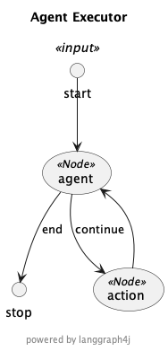

#  Spring AI Integrations

[LangGraph4j] seamlessly integrates with [Spring AI], enabling developers to build powerful LLM-based applications using familiar tools in the Java ecosystem.

## Features

-	**Graph Nodes as Spring Components**: You can define your graph flows as Spring beans, inject services, and use standard Spring dependency injection.
-	**Function Call Handling**: Automatically supports [Spring AI]’s structured function calling, parsing arguments directly into graph state.
-	**Chain of Thought**: Combine multiple [Spring AI] calls in sequence, branching based on results.
-	**Streaming**: [Spring AI]’s streaming responses can be processed and streamed through [LangGraph4j]’s async graph.
-	**Auto-Configuration**: Spring Boot automatically wires [LangGraph4j] components when using [Spring AI].
-	**Web Integration**: Easily expose your graph endpoints via REST or WebSocket using Spring MVC or WebFlux.


## Benefits:

✅ No need to rebuild logic – reuse your Langchain4j services

✅ Compose LLM workflows visually or programmatically

✅ Scalable, conditional execution of LLM calls

✅ Easy to debug and visualize


## Adding Dependencies

```xml
<dependency>
    <groupId>org.bsc.langgraph4j</groupId>
    <artifactId>langgraph4j-spring-ai</artifactId>
    <version>1.7-SNAPSHOT</version>
</dependency>
```

## Pass state to Tool

When you use [LangGraph4j] service `SpringAIToolService` to invoke a tool you can pass the State throught the [Spring AI] `ToolContext` see snippets below:


```java
//
// Passing State information to the call
//

var toolService = new SpringAIToolService( List.of(tools) );

AssistantMessage.ToolCall toolCall = ... // The object returned by LLM response to notify tool invocation request

Map<String,Object> state = Map.of( "attribute1", "value1" )

Command callResult = toolService.executeFunctions( List.of(toolCall), state);

```

```java
//
// Retrieve State information from the tool
//
@Tool(description = "tool for test AI agent executor")
String execTest2(@ToolParam(description = "test message") String message, ToolContext context ) {

    Map<String,Object> state = context.getContext();

    return format("test tool ('%s') executed", message);

}

```

It is also possible update state from the tool using `SpringAIToolResponseBuilder` 

```java
//
// Update State information from the tool
//

@Tool(description = "tool for test AI agent executor")
String execTest2(@ToolParam(description = "test message") String message, ToolContext context ) {

    return SpringAIToolResponseBuilder.of(context)
            .update( Map.of( "arg0", message, "arg1", "execTest2" ) )
            .buildAndReturn( format("test tool ('%s') executed", message) );
}

```


## ReACT Agent 

This is an implementation of ReACT agent in [Spring AI] using Langgraph4j

### Diagram



### Getting Started


```java
@SpringBootApplication
public class SpringAiDemoApplication {
    public static void main(String[] args) {
        SpringApplication.run(SpringAiDemoApplication.class, args);
    }
}
```

### Configuration

```java
@Configuration
public class ChatModelConfiguration {

    @Bean
    @Profile("ollama")
    public ChatModel ollamaModel() {
        return  OllamaChatModel.builder()
                .ollamaApi( new OllamaApi( "http://localhost:11434" ) )
                .defaultOptions(OllamaOptions.builder()
                        .model("qwen2.5:7b")
                        .temperature(0.1)
                        .build())
                .build();
    }

    @Bean
    @Profile("openai")
    public ChatModel openaiModel() {
        return OpenAiChatModel.builder()
                .openAiApi(OpenAiApi.builder()
                        .baseUrl("https://api.openai.com")
                        .apiKey(System.getenv("OPENAI_API_KEY"))
                        .build())
                .defaultOptions(OpenAiChatOptions.builder()
                        .model("gpt-4o-mini")
                        .logprobs(false)
                        .temperature(0.1)
                        .build())
                .build();

    }

}
```

### Console application

```java
@Controller
public class DemoConsoleController implements CommandLineRunner {
    private static final org.slf4j.Logger log = org.slf4j.LoggerFactory.getLogger(DemoConsoleController.class);

    private final ChatModel chatModel;
    private final List<ToolCallback> tools;

    public DemoConsoleController( ChatModel chatModel, List<ToolCallback> tools) {

        this.chatModel = chatModel;
        this.tools = tools;
    }

    @Override
    public void run(String... args) throws Exception {

        log.info("Welcome to the Spring Boot CLI application!");

        var graph = AgentExecutor.builder()
                        .chatModel(chatModel)
                        .tools(tools)
                        .build();

        var workflow = graph.compile();

        var iterator = workflow.stream( Map.of( "messages", new UserMessage("what is the result of 234 + 45") ));

        for( var step : iterator ) {
            System.out.println( step );
        }

    }
}
```

## 🚀 Studio configuration

```java
@Configuration
public class LangGraphStudioConfiguration extends LangGraphStudioConfig {

    final StateGraph<AgentExecutorEx.State> workflow;

    @Override
    public Map<String, LangGraphStudioServer.Instance> instanceMap() {

        return  Map.of( "sample", LangGraphStudioServer.Instance.builder()
                .title("LangGraph Studio (Spring AI)")
                .addInputStringArg( "messages", true, v -> new UserMessage( Objects.toString(v) ) )
                .graph( workflow )
                .compileConfig( CompileConfig.builder()
                        .checkpointSaver( new MemorySaver() )
                        .releaseThread(true)
                        .build())
                .build());

    }

    public LangGraphStudioConfiguration( ChatModel chatModel ) throws GraphStateException {

        this.workflow = AgentExecutorEx.builder()
                .chatModel(chatModel, true)
                .toolsFromObject(new TestTools())
                .build();
    }

}
```


[Spring AI]: https://spring.io/projects/spring-ai
[langgraph4j]: https://github.com/langgraph4j/langgraph4j